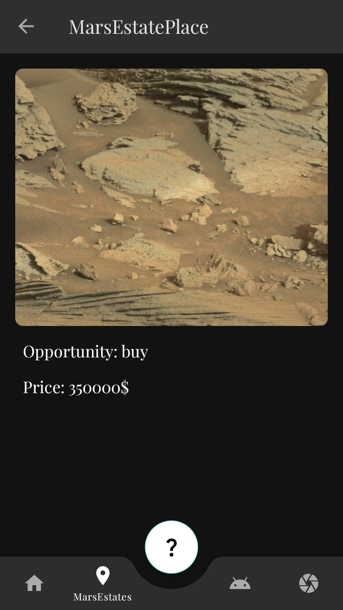

<div id="top"></div>

<br />
<div align="center">
  <a>
   
  </a>

<h3 align="center">InSpace</h3>
  
</div>


<details>
  <summary>Table of Contents</summary>
  <ol>
    <li>
      <a href="#about-the-project">About The Project</a>
      <ul>
        <li><a href="#list-of-main-used-technologies">List of main used technologies</a></li>
      </ul>
    </li>
    <li>
      <a href="#getting-started">Getting Started</a>
      <ul>
        <li><a href="#prerequisites">Prerequisites</a></li>
        <li><a href="#installation">Installation</a></li>
      </ul>
    </li>
    <li><a href="#usage">Usage</a></li>
    <li><a href="#roadmap">Roadmap</a></li>
    <li><a href="#contributing">Contributing</a></li>
      <li><a href="#license">License</a></li>
    <li><a href="#contact">Contact</a></li>
  </ol>
</details>


## About The Project
___
This application was developed in the Kotlin programming language in the integrated Android Studio environment. In it, the user can visit the vast expanses of space, view various assets associated with the most remote corners of our galaxy and feel like a real interplanetary traveler. The functionality of the application will be described in the [usage](#usage) chapter with subsequent demonstrations.


### List of main used technologies

* [MVVM](https://metanit.com/sharp/wpf/22.1.php)
* [Data Binding](https://developer.android.com/topic/libraries/data-binding)
* [Jetpack navigation component](https://developer.android.com/guide/navigation)
* [Coroutine](https://developer.android.com/kotlin/coroutines)
* [Binding adapters](https://developer.android.com/topic/libraries/data-binding/binding-adapters)
* [BottomNavigationView](https://developer.android.com/reference/com/google/android/material/bottomnavigation/BottomNavigationView)
* [RecyclerView](https://metanit.com/java/android/5.11.php)
* [Glide](https://github.com/bumptech/glide)
* [Room](https://developer.android.com/training/data-storage/room)
* [WorkManager](https://developer.android.com/topic/libraries/architecture/workmanager)


## Getting Started
___

### Prerequisites

To test the project, you will need the Android SDK.
* Link to install from the official website https://developer.android.com/studio

 

### Installation
1. Clone the repo to your local computer
   ```sh
   git clone https://github.com/Marmalaade/InSpace.git
   ```
3. Launch Android Studio
4. Click <font color ="green">Run</font> on the toolbar


## Usage
___
### The next chapter will show an example of the project with visual demonstrations of the expected result. Describes the main part of the functionality.

* After launching the application and showing the screensaver, you get to the main page with a navigation bar and various tools.
  <p>
    
    
  </p>
 
 * You can get acquainted with the illustration, its description and even find an Easter egg!
    <p>
    
    </p>

* For a little information about the app, click on the fab button below.
    <p>
    
    </p>

* On the second tab, you will see a list of the received estates on Mars. You can also click on each of them and view more detailed information about prices and opportunities to purchase it.
    <p>
    
    
    </p>
* You can also filter the list based on your wishes.
     <p>
    
    </p>
* The third tab contains information about the developer with links to the corresponding programs.
     <p>
    
    </p>
* The fourth tab is an image of the earth from a satellite in orbit. You can choose a specific snapshot based on the date and time.
     <p>
    
    
    </p>
* Before showing the snapshot, a dialog box will appear asking you to allow access to media files on your device.
     <p>
    
    
    </p>
* A picture with the ability to zoom allows you to view the smallest details of the photo.
     <p>
  
  </p>


* When you click on the image, the bottom fragment appears with two possibilities.
  <p>
    
    </p>
* When the Internet connection is disconnected, the application will notify you about it. All unloaded items that were not saved to the database will be loaded automatically after the Internet is turned on.
     <p>
    
     
    </p>


## Roadmap
___
- Improved application design
- Optimization and expansion of functionality


## Contributing
___

If someone ever sees this small project and he has a desire to transform and give him a second wind, you are welcome!
To do this, follow these instructions:

1. Fork the Project
2. Create your Feature Branch (`git checkout -b feature/[your branch name]`)
3. Commit your Changes (`git commit -m '[your feature name]'`)
4. Push to the Branch (`git push origin feature/[your branch name]`)
5. Open a Pull Request

## License
___

The module is available as open source under the terms of the 

[](https://opensource.org/licenses/Apache-2.0)


## Contact
___
Marmalade: [Telegram](https://t.me/Marmalllade)

Project Link: [GitHub](https://github.com/Marmalaade/InSpace)

## P.S.
___
I have only recently started my journey in android development and I am very grateful to you that you have familiarized yourself with the project to the end. Good luck! :wink:
